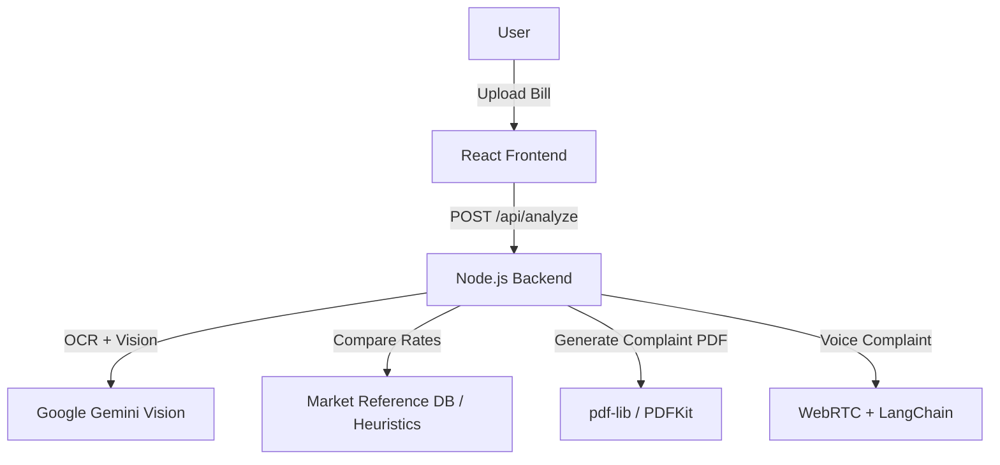

# BillBiopsy

<p align="center">
  
  
  
  
  
</p>

---

<p align="center">
  <strong>Medical Bill Analysis Tool using OCR and LLMs.</strong><br>
  <em>A Hackathon project demonstrating the use of Computer Vision for auditing healthcare invoices.</em>
</p>

---

<div align="center">
  
  &nbsp;
  
</div>

---

## 📂 Project Overview

BillBiopsy is a technical prototype designed to parse medical invoices using Optical Character Recognition (OCR) and Large Language Models (LLMs). The system focuses on automating the verification of line items against a reference database.

**Core Functionality:**
- **OCR Integration:** Utilizes Google Gemini Vision to extract text and semantic data from images/PDFs.
- **Logic Engine:** Algorithms to detect discrepancies in pricing logic.
- **Automated Document Generation:** Programmatic PDF creation using `pdf-lib`.
- **Speech-to-Text:** Implements WebRTC for capturing voice input, processed via LangChain.
- **Privacy Design:** In-memory processing architecture; no persistent database storage for sensitive data.

---

## 🛠️ Tech Stack

| Component | Technology Used | Purpose |
|---|---|---|
| **Frontend** | React + Vite | User Interface & State Management |
| **Backend** | Node.js + Express | API Routing & Middleware |
| **AI / ML** | Google Gemini Vision | Image-to-Text & Data Extraction |
| **Logic** | LangChain + Groq | Natural Language Processing for context |
| **IO** | Multer | Multipart form-data handling |

---

## ⚡ Quickstart

To run this project locally for development:

```bash
# 1. Clone the repository
git clone [https://github.com/Gagan021-5/BillBiopsy.git](https://github.com/Gagan021-5/BillBiopsy.git)

# 2. Install dependencies
npm run install-all

# 3. Environment Configuration
# Create a .env file in the server directory with the following keys:
# GEMINI_API_KEY=your_key
# GROQ_API_KEY=your_key
# PORT=5000

# 4. Run Development Server
npm run dev

```

## Run Locally (Notes)

- The project processes files in-memory; large files increase memory usage.  
- Bill images/PDFs must be reasonably clear for accurate OCR.  
- The complaint PDF generation UI only shows the button when flagged items exist.

---

## Project Structure

```
billbiopsy/
├── frontend/                 # React frontend
│   ├── src/
│   │   ├── App.jsx         # Main app
│   │   ├── main.jsx        # Entry point
│   │   ├── index.css       # Global styles
│   │   └── components/     # Cards, Buttons, ComplaintGenerator, etc.
│   ├── index.html
│   └── package.json
├── backend/                 # Express backend
│   ├── index.js            # Main server file
│   ├── routes/             # API routes
│   ├── controllers/        # Logic for bills, complaints, voice
│   ├── middleware/         # Multer, audio handling, etc.
│   ├── chains/             # LangChain complaint logic
│   └── package.json
├── package.json            # Root package.json
└── README.md
```

---

## API Endpoints

- POST `/api/analyze` — Multipart upload for image/PDF analysis.
- POST `/api/generate-complaint` — Logic endpoint to structure audit results.
- POST `/api/generate-complaint-pdf` — Stream endpoint for PDF generation.
- POST `/api/voice-complaint` — Transcribe user audio complaint (multipart/form-data audio/webm). Response: `{ transcript }`.  
- GET `/api/health` — Service status check.
---

## Usage

1. Upload a hospital bill (JPG, PNG, or PDF).  
2. Click "Analyze Bill" to run OCR + AI detection.  
3. Review itemized results; flagged items will be highlighted.  
4. Dictate your complaint (or type and edit it).  
5. If flagged items exist, generate and download the complaint PDF.

---


## Architecture



## 🚨 Disclaimer
This software is a proof-of-concept created for a hackathon/educational demonstration. It is not intended for commercial use or medical advice.
