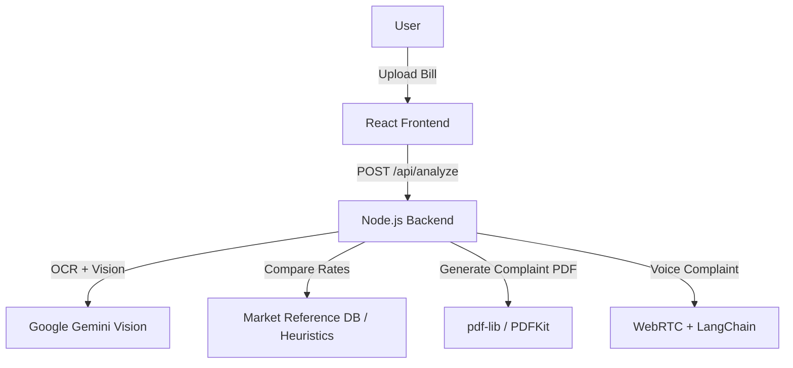

# 💪 BillBiopsy — Your AI-Powered Patient Advocate

<p align="center">

</p>

<p align="center">
  <a href="https://example-demo-url.com" target="_blank">
    
  </a>
  
  
  
  
  
</p>

---

An AI-powered medical bill analyzer focused on the Indian healthcare market.

- Analyze hospital bills line-by-line  
- Detect likely overcharges and mismatches  
- Generate complaint letters / PDFs when issues are found  
- Voice-based complaint input (transcription)  
- All processing is in-memory — no authentication or database required


---

## Why BillBiopsy?

- 🕒 Save time — automated, line-by-line analysis in seconds.  
- 💸 Save money — detect overcharges and estimate potential refunds.  
- 📝 Take action — generate formal complaint PDFs only when flagged items exist.  
- 🎙️ Voice support — dictate your complaint instead of typing.  
- 🇮🇳 India-focused — pricing comparisons and heuristics optimized for Indian healthcare.

---

## Features

- Upload medical bills (JPG, PNG, PDF)  
- AI-powered OCR & semantic analysis with Google Gemini Vision  
- Automatic overpricing detection against reference market rates  
- Itemized breakdown and summary of potential savings  
- Conditional complaint PDF generation (only when flagged items exist)  
- Voice complaint transcription and integration into the complaint  
- No auth required — processing in-memory for privacy  
- Supports bills up to 10MB by default (adjustable)

---

## Tech Stack

| Frontend | Backend | AI / Integrations |
|---|---|---|
| React (Vite) | Node.js + Express | Google Gemini Vision |
| CSS / Tailwind | Multer (file uploads) | LangChain + Groq LLM |
| WebRTC Audio | pdf-lib / PDFKit | Optical Character Recognition (via Gemini Vision) |

---

## Quickstart

Clone the repo:

```bash
git clone https://github.com/Gagan021-5/BillBiopsy.git
```

Install dependencies for both frontend and backend:

```bash
npm run install-all
```

Configure environment variables (server/.env):

```
GEMINI_API_KEY=your_gemini_api_key_here
GROQ_API_KEY=your_groq_api_key_here
PORT=5000
```

Run in development (both frontend & backend):

```bash
npm run dev
```

Or run separately:

Backend:
```bash
cd backend
npm run dev
```

Frontend:
```bash
cd frontend
npm run dev
```

- Frontend: http://localhost:3000  
- Backend API: http://localhost:5000

---

## Environment Variables

Create `server/.env` and add:

- `GEMINI_API_KEY` — API key for Google Gemini Vision  
- `GROQ_API_KEY` — API key for Groq LLM (LangChain backend)  
- `PORT` — server port (default: 5000)

Make sure keys are kept secret and not checked into source control.

---

## Run Locally (Notes)

- The project processes files in-memory; large files increase memory usage.  
- Bill images/PDFs must be reasonably clear for accurate OCR.  
- The complaint PDF generation UI only shows the button when flagged items exist.

---

## Project Structure

```
billbiopsy/
├── frontend/                 # React frontend
│   ├── src/
│   │   ├── App.jsx         # Main app
│   │   ├── main.jsx        # Entry point
│   │   ├── index.css       # Global styles
│   │   └── components/     # Cards, Buttons, ComplaintGenerator, etc.
│   ├── index.html
│   └── package.json
├── backend/                 # Express backend
│   ├── index.js            # Main server file
│   ├── routes/             # API routes
│   ├── controllers/        # Logic for bills, complaints, voice
│   ├── middleware/         # Multer, audio handling, etc.
│   ├── chains/             # LangChain complaint logic
│   └── package.json
├── package.json            # Root package.json
└── README.md
```

---

## API Endpoints

- POST `/api/analyze` — Upload and analyze a hospital bill (multipart/form-data with bill file). Response: itemized prices, flagged overcharges, summary.  
- POST `/api/generate-complaint` — Generate AI complaint text from audit results and optional voice transcript (JSON `{ transcript, auditResult }`). Response: `{ complaintText }`.  
- POST `/api/generate-complaint-pdf` — Generate complaint PDF (only if there are flagged items). Request: `{ complaintText }`. Response: PDF download.  
- POST `/api/voice-complaint` — Transcribe user audio complaint (multipart/form-data audio/webm). Response: `{ transcript }`.  
- GET `/api/health` — Basic health check.

---

## Usage

1. Upload a hospital bill (JPG, PNG, or PDF).  
2. Click "Analyze Bill" to run OCR + AI detection.  
3. Review itemized results; flagged items will be highlighted.  
4. Dictate your complaint (or type and edit it).  
5. If flagged items exist, generate and download the complaint PDF.

---

## Notes & Limits

- All processing happens in-memory; no database persists sensitive data.  
- Bills supported up to 10MB (default). Increase limit in server if required.  
- Accuracy depends on bill quality and format. Manual verification of results is recommended.  
- This project is focused on Indian pricing heuristics — adapt reference data for other regions.

---

## Architecture




## License

MIT
